# REST API
This api can be used for get, post, update and deleate data files and users from data base.

## Postman tests:

## Запуск сервера

## Cтворення файлу з даними
### Запит
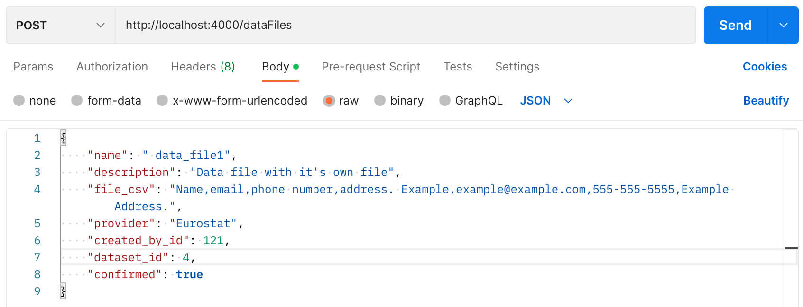
### Результат
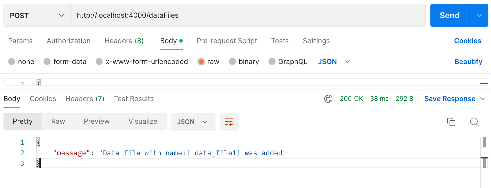
## Вивід всих файлів з даними
### Запит
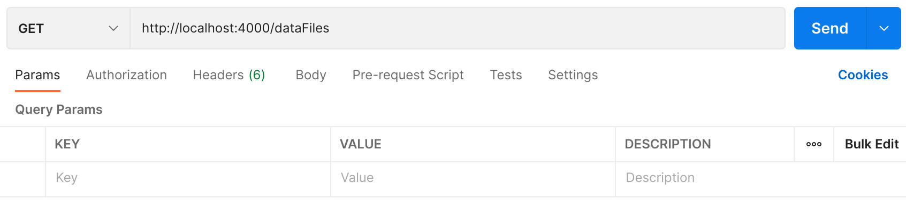
### Результат

## Вивід конкретного файлу з даними (по id)
### Запит
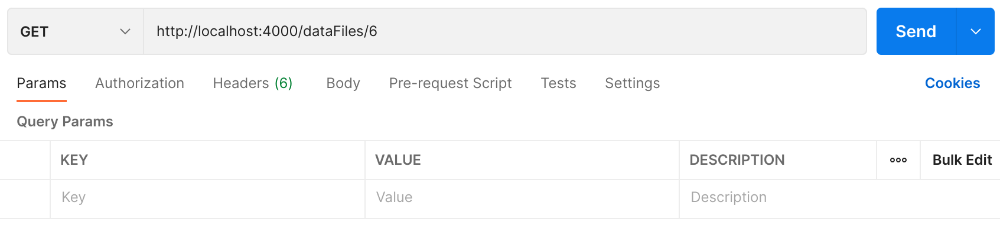
### Результат
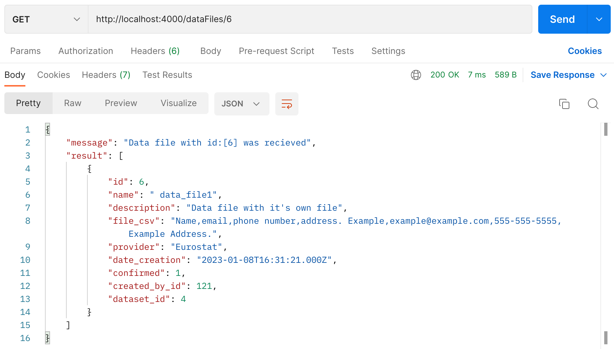
## Оновлення файлу з даними (по id)
### До відновлення
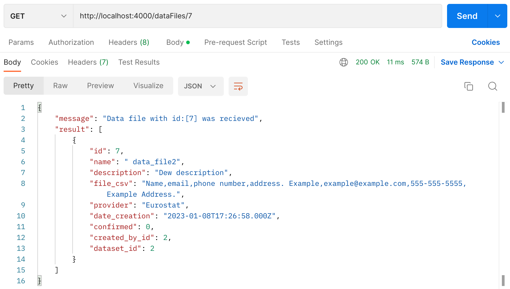
### Запит
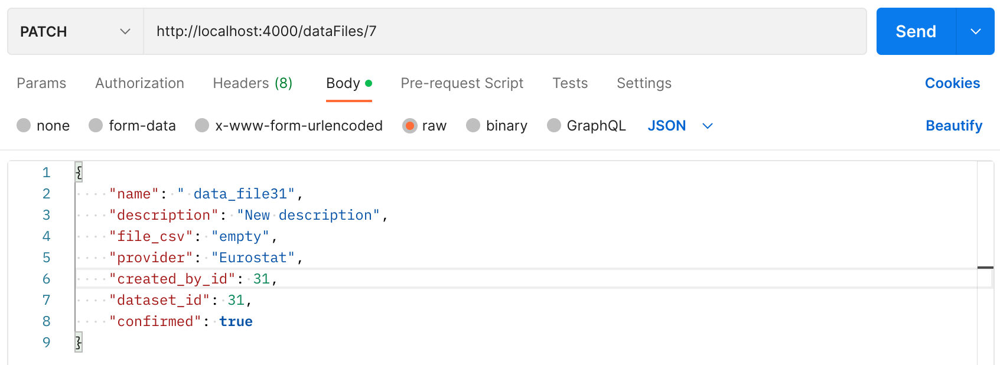
### Відповідь
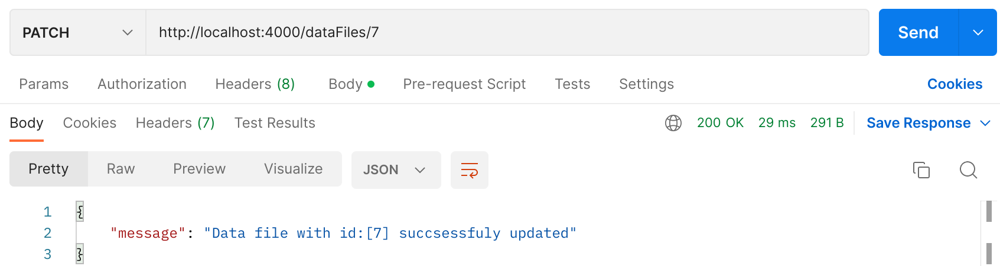
### Результат
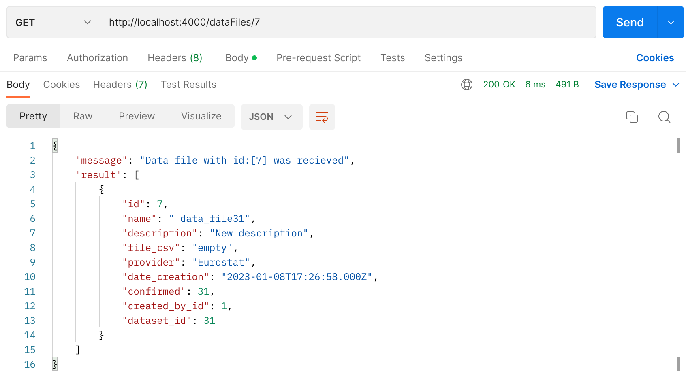
## Видалення файлу з даними (по id)
### Запит
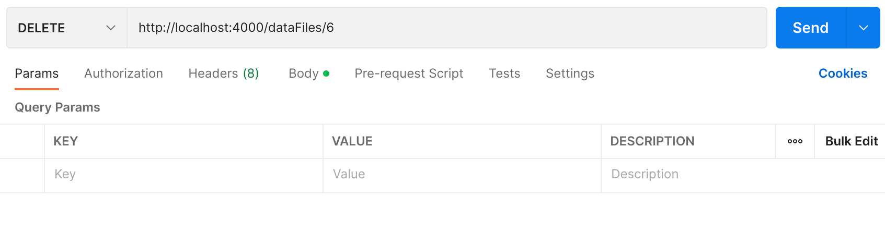
### Відповідь
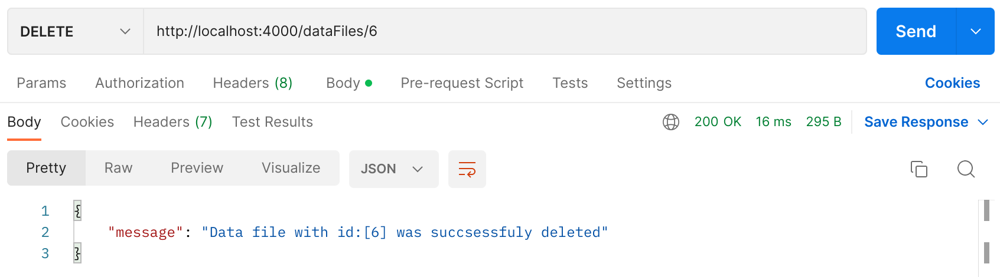
### Результат
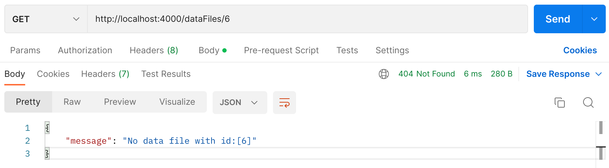
